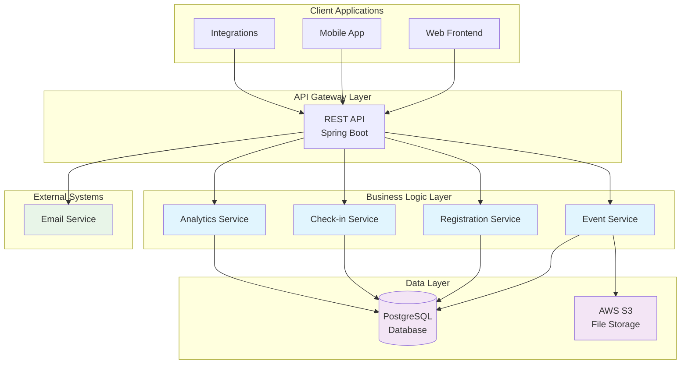

# API Documentation

## Overview

The Eventr API is a RESTful web service built with Spring Boot that provides comprehensive event management capabilities. The API follows REST conventions and returns JSON responses.

**Base URL:** `http://localhost:8080/api`

**Content-Type:** `application/json`

## Authentication

Currently, the API is in development mode without authentication requirements. In production, JWT-based authentication will be required for most endpoints.

## Architecture Overview



## Core Concepts

### Events
Events are the primary entity in the system. They represent gatherings, meetings, or activities that users can register for.

### Sessions
Sessions are sub-components of events, allowing for multi-track or multi-day events with different time slots and topics.

### Registrations
User registrations for events, tracking attendance intent and user information.

### Check-ins
Actual attendance tracking when users arrive at events or sessions.

## Event Management API

### List Events
```http
GET /api/events
```

**Query Parameters:**
- `page` (optional): Page number (0-based)
- `size` (optional): Page size (default: 20)
- `sort` (optional): Sort field and direction (e.g., `name,asc`)
- `category` (optional): Filter by event category
- `type` (optional): Filter by event type (`IN_PERSON`, `VIRTUAL`, `HYBRID`)

**Response:**
```json
{
  "content": [
    {
      "id": "123e4567-e89b-12d3-a456-426614174000",
      "name": "Tech Conference 2024",
      "description": "Annual technology conference",
      "type": "HYBRID",
      "category": "TECHNOLOGY",
      "startDate": "2024-09-15T09:00:00Z",
      "endDate": "2024-09-15T17:00:00Z",
      "location": "Convention Center",
      "maxAttendees": 500,
      "registrationCount": 245,
      "status": "ACTIVE"
    }
  ],
  "pageable": {...},
  "totalElements": 50,
  "totalPages": 3
}
```

### Create Event
```http
POST /api/events
```

**Request Body:**
```json
{
  "name": "Tech Conference 2024",
  "description": "# Annual Technology Conference\n\nJoin us for cutting-edge tech talks...",
  "type": "HYBRID",
  "category": "TECHNOLOGY",
  "startDate": "2024-09-15T09:00:00Z",
  "endDate": "2024-09-15T17:00:00Z",
  "location": "Convention Center",
  "maxAttendees": 500,
  "registrationDeadline": "2024-09-10T23:59:59Z",
  "tags": ["technology", "conference", "networking"]
}
```

### Get Event Details
```http
GET /api/events/{eventId}
```

**Response:**
```json
{
  "id": "123e4567-e89b-12d3-a456-426614174000",
  "name": "Tech Conference 2024",
  "description": "# Annual Technology Conference\n\nJoin us for cutting-edge tech talks...",
  "type": "HYBRID",
  "category": "TECHNOLOGY",
  "startDate": "2024-09-15T09:00:00Z",
  "endDate": "2024-09-15T17:00:00Z",
  "location": "Convention Center",
  "maxAttendees": 500,
  "registrationCount": 245,
  "sessions": [
    {
      "id": "session-uuid",
      "title": "Keynote Session",
      "startTime": "2024-09-15T09:00:00Z",
      "endTime": "2024-09-15T10:30:00Z",
      "maxAttendees": 500
    }
  ],
  "status": "ACTIVE",
  "createdAt": "2024-08-01T10:00:00Z"
}
```

## Registration Management API

### Register for Event
```http
POST /api/registrations
```

**Request Body:**
```json
{
  "eventId": "123e4567-e89b-12d3-a456-426614174000",
  "userEmail": "user@example.com",
  "userName": "John Doe",
  "additionalInfo": {
    "company": "Tech Corp",
    "dietary_restrictions": "Vegetarian"
  }
}
```

### List Registrations
```http
GET /api/registrations
```

**Query Parameters:**
- `eventId` (optional): Filter by event ID
- `userEmail` (optional): Filter by user email
- `status` (optional): Filter by status (`REGISTERED`, `CANCELLED`)

## Check-in Management API

### Manual Check-in
```http
POST /api/check-in
```

**Request Body:**
```json
{
  "registrationId": "reg-uuid",
  "sessionId": "session-uuid",
  "type": "SESSION",
  "method": "MANUAL",
  "checkedInBy": "Staff Member",
  "deviceId": "device-123",
  "location": "Main Entrance",
  "notes": "VIP attendee"
}
```

### QR Code Check-in
```http
POST /api/check-in/qr
```

**Request Body:**
```json
{
  "qrCode": "encoded-qr-data",
  "deviceId": "scanner-001",
  "location": "Entrance A"
}
```

### Get Attendance Statistics
```http
GET /api/events/{eventId}/statistics
```

**Response:**
```json
{
  "eventId": "123e4567-e89b-12d3-a456-426614174000",
  "eventName": "Tech Conference 2024",
  "totalRegistrations": 245,
  "totalCheckIns": 198,
  "uniqueCheckIns": 195,
  "checkInRate": 79.6,
  "averageCheckInTime": 2.5
}
```

## Session Management API

### Create Session
```http
POST /api/sessions
```

**Request Body:**
```json
{
  "eventId": "123e4567-e89b-12d3-a456-426614174000",
  "title": "Advanced React Patterns",
  "description": "Deep dive into advanced React patterns and performance optimization",
  "startTime": "2024-09-15T14:00:00Z",
  "endTime": "2024-09-15T15:30:00Z",
  "location": "Room A",
  "maxAttendees": 50,
  "prerequisites": ["Basic React knowledge"],
  "tags": ["react", "javascript", "frontend"]
}
```

### List Sessions
```http
GET /api/sessions
```

**Query Parameters:**
- `eventId`: Filter by event ID
- `startTime` (optional): Filter sessions starting after this time
- `endTime` (optional): Filter sessions ending before this time

## Error Handling

The API uses conventional HTTP response codes and returns detailed error information in JSON format.

### HTTP Status Codes
- `200 OK`: Successful GET, PUT requests
- `201 Created`: Successful POST requests
- `204 No Content`: Successful DELETE requests
- `400 Bad Request`: Invalid request parameters or body
- `404 Not Found`: Resource not found
- `409 Conflict`: Resource conflict (e.g., duplicate registration)
- `500 Internal Server Error`: Server error

### Error Response Format
```json
{
  "timestamp": "2024-08-24T10:15:30Z",
  "status": 400,
  "error": "Bad Request",
  "message": "Registration deadline has passed",
  "path": "/api/registrations",
  "details": {
    "field": "eventId",
    "rejectedValue": "expired-event-id",
    "code": "REGISTRATION_CLOSED"
  }
}
```

## Pagination

List endpoints support pagination using the following parameters:
- `page`: Page number (0-based)
- `size`: Number of items per page (default: 20, max: 100)
- `sort`: Sort criteria in the format `property,direction` (e.g., `name,asc`)

**Paginated Response Format:**
```json
{
  "content": [...],
  "pageable": {
    "sort": {...},
    "pageNumber": 0,
    "pageSize": 20
  },
  "totalElements": 100,
  "totalPages": 5,
  "first": true,
  "last": false,
  "numberOfElements": 20
}
```

## Rate Limiting

*Note: Rate limiting is planned for production deployment*

- Default: 1000 requests per hour per IP
- Authenticated users: 5000 requests per hour
- Headers included in responses:
  - `X-RateLimit-Limit`: Request limit
  - `X-RateLimit-Remaining`: Remaining requests
  - `X-RateLimit-Reset`: Rate limit reset time

## API Versioning

The API currently uses URL path versioning:
- Current version: `v1` (implied, no version in path)
- Future versions: `/api/v2/...`

Breaking changes will result in a new API version while maintaining backward compatibility for existing versions.

## Testing the API

### Using cURL

**Create an event:**
```bash
curl -X POST http://localhost:8080/api/events \
  -H "Content-Type: application/json" \
  -d '{
    "name": "Test Event",
    "description": "A test event",
    "type": "IN_PERSON",
    "startDate": "2024-12-01T10:00:00Z",
    "endDate": "2024-12-01T15:00:00Z",
    "maxAttendees": 100
  }'
```

**Register for an event:**
```bash
curl -X POST http://localhost:8080/api/registrations \
  -H "Content-Type: application/json" \
  -d '{
    "eventId": "your-event-id",
    "userEmail": "test@example.com",
    "userName": "Test User"
  }'
```

### Using the Interactive API Documentation

Visit http://localhost:8080/swagger-ui.html for interactive API documentation with a built-in API explorer.

## SDK and Client Libraries

*Planned for future releases*

- JavaScript/TypeScript SDK
- Python SDK  
- Java SDK
- REST API Postman Collection

## Support

For API support and questions:
- Check the [GitHub Issues](https://github.com/jpwhite3/eventr/issues)
- See [Architecture Documentation](architecture.md) for system design details
