# Architecture Documentation

## System Overview

Eventr is a full-stack event management platform built with modern architectural principles including SOLID design patterns, event-driven architecture, and microservice-ready patterns.

## High-Level Architecture


## Domain Model


## Service Architecture (SOLID Principles)

### Single Responsibility Principle

Each service has a single, well-defined responsibility:


### Dependency Inversion Principle

Services depend on abstractions, not concretions:

```mermaid
graph TB
    subgraph "Interfaces"
        CHECKIN_INT[CheckInServiceInterface]
        WEBHOOK_INT[WebhookServiceInterface]
        HTTP_INT[HttpClientInterface]
        EMAIL_INT[EmailServiceInterface]
    end
    
    subgraph "Implementations"
        CHECKIN_IMPL[EventDrivenCheckInService]
        WEBHOOK_IMPL[WebhookServiceImpl]
        HTTP_IMPL[SpringHttpClient]
        EMAIL_IMPL[SmtpEmailService]
    end
    
    subgraph "Controllers"
        CHECKIN_CTRL[CheckInController]
        WEBHOOK_CTRL[WebhookController]
    end
    
    CHECKIN_CTRL --> CHECKIN_INT
    WEBHOOK_CTRL --> WEBHOOK_INT
    
    CHECKIN_INT <|.. CHECKIN_IMPL
    WEBHOOK_INT <|.. WEBHOOK_IMPL
    HTTP_INT <|.. HTTP_IMPL
    EMAIL_INT <|.. EMAIL_IMPL
    
    CHECKIN_IMPL --> HTTP_INT
    WEBHOOK_IMPL --> HTTP_INT
    CHECKIN_IMPL --> EMAIL_INT
```

## Event-Driven Architecture

### Domain Events Flow


### Event Types and Handlers


## Data Layer Architecture

### Repository Pattern

```mermaid
graph TB
    subgraph "Repository Interfaces"
        EVENT_REPO_INT[EventRepository]
        REG_REPO_INT[RegistrationRepository]
        CHECKIN_REPO_INT[CheckInRepository]
        WEBHOOK_REPO_INT[WebhookRepository]
    end
    
    subgraph "JPA Implementations"
        EVENT_REPO[EventRepository<br/>extends JpaRepository]
        REG_REPO[RegistrationRepository<br/>extends JpaRepository]
        CHECKIN_REPO[CheckInRepository<br/>extends JpaRepository]
        WEBHOOK_REPO[WebhookRepository<br/>extends JpaRepository]
    end
    
    subgraph "Custom Queries"
        EVENT_CUSTOM[Custom Event Queries<br/>- findByCategory<br/>- findUpcoming<br/>- searchByName]
        CHECKIN_CUSTOM[Custom CheckIn Queries<br/>- statisticsByEvent<br/>- findRecentCheckIns<br/>- countByMethod]
    end
    
    EVENT_REPO_INT <|.. EVENT_REPO
    REG_REPO_INT <|.. REG_REPO
    CHECKIN_REPO_INT <|.. CHECKIN_REPO
    WEBHOOK_REPO_INT <|.. WEBHOOK_REPO
    
    EVENT_REPO --> EVENT_CUSTOM
    CHECKIN_REPO --> CHECKIN_CUSTOM
```

### Database Schema Design


## Security Architecture

### Authentication & Authorization Flow


### Role-Based Access Control


## API Design Patterns

### RESTful Resource Design

```mermaid
graph TB
    subgraph "Resource Hierarchy"
        EVENTS[/api/events]
        EVENT_ID[/api/events/{id}]
        EVENT_SESSIONS[/api/events/{id}/sessions]
        EVENT_REGISTRATIONS[/api/events/{id}/registrations]
        EVENT_ANALYTICS[/api/events/{id}/analytics]
        
        REGISTRATIONS[/api/registrations]
        REG_ID[/api/registrations/{id}]
        
        CHECKINS[/api/check-ins]
        CHECKIN_ID[/api/check-ins/{id}]
        
        WEBHOOKS[/api/webhooks]
        WEBHOOK_ID[/api/webhooks/{id}]
        WEBHOOK_TEST[/api/webhooks/{id}/test]
    end
    
    EVENTS --> EVENT_ID
    EVENT_ID --> EVENT_SESSIONS
    EVENT_ID --> EVENT_REGISTRATIONS
    EVENT_ID --> EVENT_ANALYTICS
    
    REGISTRATIONS --> REG_ID
    CHECKINS --> CHECKIN_ID
    WEBHOOKS --> WEBHOOK_ID
    WEBHOOK_ID --> WEBHOOK_TEST
```

### Error Handling Strategy

```mermaid
flowchart TD
    A[API Request] --> B{Validation}
    B -->|Pass| C[Business Logic]
    B -->|Fail| D[400 Bad Request]
    
    C --> E{Business Rules}
    E -->|Pass| F[Data Operation]
    E -->|Fail| G[409 Conflict]
    
    F --> H{Database Operation}
    H -->|Success| I[200/201 Response]
    H -->|Not Found| J[404 Not Found]
    H -->|Error| K[500 Internal Error]
    
    D --> L[Error Response JSON]
    G --> L
    J --> L
    K --> L
    
    L --> M[Structured Error Format:<br/>{timestamp, status, error,<br/> message, path, details}]
```

## Performance Considerations

### Caching Strategy


### Scalability Patterns


## Deployment Architecture

### Container Architecture


### CI/CD Pipeline


## Testing Architecture

### Testing Pyramid

```mermaid
graph TB
    subgraph "Testing Levels"
        E2E[End-to-End Tests<br/>Cypress/Playwright<br/>🔺]
        INTEGRATION[Integration Tests<br/>Testcontainers<br/>🔶]
        UNIT[Unit Tests<br/>JUnit + Mockito<br/>🟦]
    end
    
    subgraph "Test Coverage"
        UNIT_COV[Unit: >90%<br/>Fast execution<br/>Isolated components]
        INT_COV[Integration: >80%<br/>Real dependencies<br/>API contracts]
        E2E_COV[E2E: Key flows<br/>User scenarios<br/>Cross-browser]
    end
    
    UNIT --> UNIT_COV
    INTEGRATION --> INT_COV
    E2E --> E2E_COV
```



### Test Data Strategy


## Monitoring and Observability

### Application Monitoring


### Health Check Strategy


This architecture documentation provides a comprehensive view of Eventr's system design, following modern software engineering practices and architectural patterns. The system is designed for scalability, maintainability, and testability while providing robust event management capabilities with integrated webhook support.