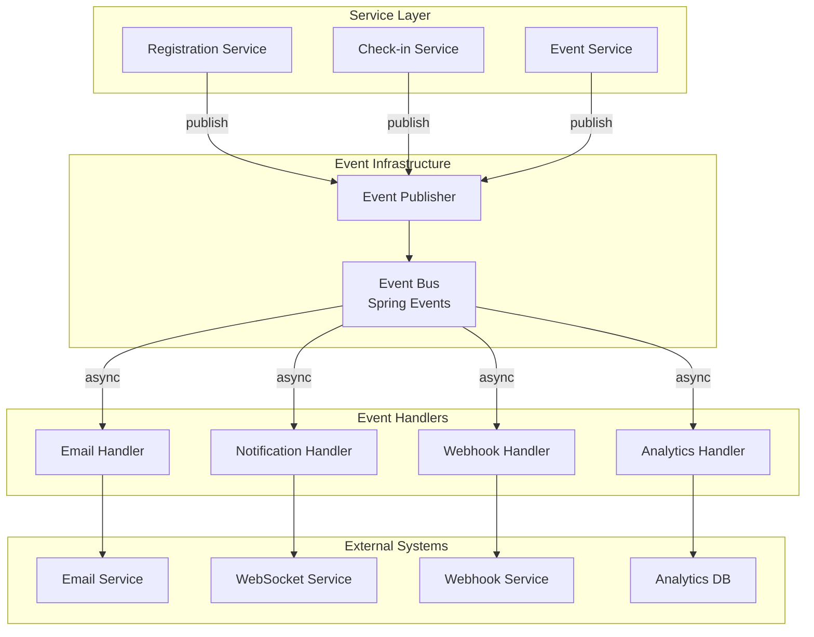

# ADR-002: Event-Driven Architecture for Domain Events

## Status
**Accepted** - September 8, 2024

## Context
The EventR application handles complex business workflows where actions in one domain need to trigger activities in other domains. Examples include:

1. **Registration Events**: When someone registers for an event, multiple systems need to respond (email notifications, analytics updates, capacity management)
2. **Check-in Events**: When attendees check in, various services need updates (attendance tracking, real-time dashboards, notifications)
3. **Event Lifecycle Events**: Event creation, publication, and cancellation trigger multiple downstream processes
4. **Resource Management Events**: Resource bookings, conflicts, and availability changes affect multiple systems

We needed an architecture that:
- **Decouples services** to prevent tight coupling between business domains
- **Enables real-time features** like live dashboards and notifications
- **Supports auditability** with event sourcing capabilities
- **Allows asynchronous processing** for performance and reliability
- **Facilitates system integration** with external services via webhooks

## Decision
We adopt an **Event-Driven Architecture** using Spring's Application Events with the following components:

### Event-Driven Components

#### 1. Domain Events (`com.eventr.events`)
```kotlin
// Base event interface
interface DomainEvent {
    val eventId: UUID
    val timestamp: LocalDateTime
    val eventType: String
}

// Specific domain events
data class AttendeeRegisteredEvent(
    override val eventId: UUID,
    override val timestamp: LocalDateTime,
    val registrationId: UUID,
    val eventId: UUID,
    val userId: UUID,
    val registrationType: RegistrationType
) : DomainEvent {
    override val eventType = "attendee.registered"
}
```

#### 2. Event Publisher (`com.eventr.events.EventPublisher`)
```kotlin
@Component
class SpringEventPublisher(
    private val applicationEventPublisher: ApplicationEventPublisher
) : EventPublisher {
    
    override fun publishEvent(event: DomainEvent) {
        applicationEventPublisher.publishEvent(event)
    }
}
```

#### 3. Event Listeners (`com.eventr.events`)
```kotlin
@Component
class EventEventListener(
    private val emailService: EmailService,
    private val analyticsService: AnalyticsService,
    private val webhookService: WebhookService
) {
    
    @EventListener
    @Async
    fun handleAttendeeRegistered(event: AttendeeRegisteredEvent) {
        // Send welcome email
        emailService.sendWelcomeEmail(event.userId, event.eventId)
        
        // Update analytics
        analyticsService.recordRegistration(event)
        
        // Trigger webhooks
        webhookService.deliverWebhook("attendee.registered", event)
    }
}
```

### Architecture Pattern


## Implementation Strategy

### 1. Event Types and Hierarchy
```kotlin
// Core event categories
sealed class EventEvents : DomainEvent {
    data class EventCreated(...)
    data class EventPublished(...)
    data class EventCancelled(...)
    data class EventUpdated(...)
}

sealed class RegistrationEvents : DomainEvent {
    data class AttendeeRegistered(...)
    data class AttendeeCheckedIn(...)
    data class AttendeeNoShow(...)
    data class RegistrationCancelled(...)
}

sealed class SessionEvents : DomainEvent {
    data class SessionCreated(...)
    data class SessionStarted(...)
    data class SessionEnded(...)
    data class SessionCancelled(...)
}

sealed class UserEvents : DomainEvent {
    data class UserLoggedIn(...)
    data class UserProfileUpdated(...)
    data class UserPasswordChanged(...)
}
```

### 2. Event Publishing Pattern
```kotlin
// In service methods
@Service
class RegistrationService(
    private val eventPublisher: EventPublisher,
    private val registrationRepository: RegistrationRepository
) {
    
    @Transactional
    fun registerAttendee(eventId: UUID, userId: UUID, registrationDto: RegistrationDto): Registration {
        // Core business logic
        val registration = Registration(...)
        val savedRegistration = registrationRepository.save(registration)
        
        // Publish domain event
        val event = AttendeeRegisteredEvent(
            eventId = UUID.randomUUID(),
            timestamp = LocalDateTime.now(),
            registrationId = savedRegistration.id!!,
            eventId = eventId,
            userId = userId,
            registrationType = registrationDto.type
        )
        eventPublisher.publishEvent(event)
        
        return savedRegistration
    }
}
```

### 3. Event Handler Configuration
```kotlin
// Event handlers with proper error handling
@Component
class RegistrationEventHandlers(
    private val emailService: EmailService,
    private val analyticsService: AnalyticsService
) {
    
    @EventListener
    @Async
    @Retryable(value = [Exception::class], maxAttempts = 3)
    fun handleAttendeeRegistered(event: AttendeeRegisteredEvent) {
        try {
            emailService.sendWelcomeEmail(event.userId, event.eventId)
            analyticsService.recordRegistration(event)
        } catch (exception: Exception) {
            // Log error and optionally publish compensation event
            logger.error("Failed to handle AttendeeRegisteredEvent", exception)
            throw exception // Retry will handle this
        }
    }
}
```

## Benefits Realized

### 1. **Loose Coupling** ✅
- Services don't directly depend on each other
- New features can subscribe to existing events
- Easy to add new event handlers without modifying existing code

### 2. **Real-time Capabilities** ✅
- WebSocket integration for live dashboard updates
- Immediate notification delivery
- Real-time analytics and monitoring

### 3. **Audit Trail** ✅
- All significant business events are captured
- Complete audit log of system activities
- Event sourcing capabilities for compliance

### 4. **Performance Benefits** ✅
- Asynchronous processing prevents blocking
- Resource-intensive operations handled in background
- Better response times for user-facing operations

### 5. **External Integration** ✅
- Webhook system leverages domain events
- Easy integration with external systems
- Event-driven partner notifications

## Configuration

### 1. Async Event Processing
```kotlin
@Configuration
@EnableAsync
class AsyncConfig {
    
    @Bean
    fun taskExecutor(): Executor {
        val executor = ThreadPoolTaskExecutor()
        executor.corePoolSize = 2
        executor.maxPoolSize = 5
        executor.queueCapacity = 100
        executor.setThreadNamePrefix("event-handler-")
        executor.initialize()
        return executor
    }
}
```

### 2. Error Handling and Retry
```kotlin
@Configuration
@EnableRetry
class EventRetryConfig {
    
    @Bean
    fun retryTemplate(): RetryTemplate {
        return RetryTemplate.builder()
            .maxAttempts(3)
            .exponentialBackoff(1000, 2.0, 10000)
            .retryOn(Exception::class.java)
            .build()
    }
}
```

## Monitoring and Observability

### 1. Event Metrics
```kotlin
@Component
class EventMetrics(private val meterRegistry: MeterRegistry) {
    
    private val eventPublishedCounter = Counter.builder("events.published")
        .description("Number of domain events published")
        .register(meterRegistry)
        
    private val eventProcessingTimer = Timer.builder("events.processing.time")
        .description("Event processing duration")
        .register(meterRegistry)
    
    fun recordEventPublished(eventType: String) {
        eventPublishedCounter.increment(Tags.of("type", eventType))
    }
}
```

### 2. Event Logging
```kotlin
@EventListener
class EventLoggingHandler {
    
    private val logger = LoggerFactory.getLogger(EventLoggingHandler::class.java)
    
    @EventListener
    fun logAllEvents(event: DomainEvent) {
        logger.info("Event published: {} at {}", event.eventType, event.timestamp)
    }
}
```

## Trade-offs and Considerations

### Positive Consequences ✅

1. **Flexibility**: Easy to add new event handlers for new requirements
2. **Scalability**: Asynchronous processing improves system throughput
3. **Maintainability**: Clear separation between business logic and side effects
4. **Testability**: Can test event publishing and handling separately
5. **Integration**: External systems easily integrate via events

### Negative Consequences ⚠️

1. **Complexity**: Additional complexity in debugging distributed event processing
2. **Eventual Consistency**: Some operations become eventually consistent
3. **Error Handling**: Need robust error handling and retry mechanisms
4. **Testing Complexity**: Need to test asynchronous event flows
5. **Monitoring Overhead**: Requires additional monitoring and observability

## Testing Strategy

### 1. Event Publishing Tests
```kotlin
@Test
fun `should publish event when attendee registers`() {
    // Given
    val eventCaptor = argumentCaptor<AttendeeRegisteredEvent>()
    
    // When
    registrationService.registerAttendee(eventId, userId, registrationDto)
    
    // Then
    verify(eventPublisher).publishEvent(eventCaptor.capture())
    assertThat(eventCaptor.firstValue.eventId).isEqualTo(eventId)
}
```

### 2. Event Handler Tests
```kotlin
@Test
fun `should send welcome email when attendee registers`() {
    // Given
    val event = AttendeeRegisteredEvent(...)
    
    // When
    eventHandler.handleAttendeeRegistered(event)
    
    // Then
    verify(emailService).sendWelcomeEmail(event.userId, event.eventId)
}
```

## Migration Path

### Phase 1: Core Events (Current)
- ✅ User events (login, profile updates)
- ✅ Registration events (register, check-in, cancel)  
- ✅ Event lifecycle events (create, publish, cancel)
- ✅ Session events (create, start, end)

### Phase 2: Advanced Events (Future)
- Resource booking events
- Payment processing events
- Integration events
- Performance monitoring events

## Related Decisions
- [ADR-003: WebSocket Real-time Updates](ADR-003-websocket-realtime.md)
- [ADR-004: Webhook External Integration](ADR-004-webhook-integration.md)
- [ADR-005: Async Processing Strategy](ADR-005-async-processing.md)

## References
- [Spring Application Events](https://spring.io/blog/2015/02/11/better-application-events-in-spring-framework-4-2)
- [Domain Events Pattern](https://martinfowler.com/eaaDev/DomainEvent.html)
- [Event Sourcing](https://martinfowler.com/eaaDev/EventSourcing.html)

---

**Decision Date**: September 8, 2024  
**Decision Makers**: EventR Development Team  
**Status**: Accepted and Actively Used