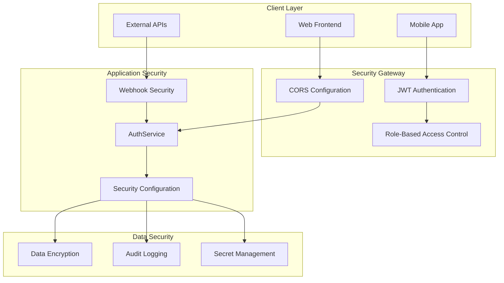

# ADR-003: Security Architecture and Authentication Strategy

## Status
**Accepted** - September 8, 2024

## Context
The EventR application handles sensitive user data including personal information, payment details, and event access credentials. We needed a comprehensive security strategy that addresses:

1. **User Authentication**: Secure user login and session management
2. **Authorization**: Role-based access control for different user types
3. **API Security**: Protection of REST endpoints and data access
4. **Development Flexibility**: Different security profiles for development vs production
5. **External Integration Security**: Secure webhook delivery and API integrations
6. **Data Protection**: Encryption and secure handling of sensitive information

## Decision
We implement a **multi-layered security architecture** with the following components:

### Security Architecture Overview


## Security Components

### 1. Development vs Production Security Profiles

#### Development Profile (`DevSecurityConfig`)
```kotlin
@Configuration
@Profile("dev")
class DevSecurityConfig {
    
    @Bean
    fun devSecurityFilterChain(http: HttpSecurity): SecurityFilterChain {
        return http
            .cors { it.disable() } // Handled by WebConfig
            .csrf { it.disable() } // Disabled for development
            .authorizeHttpRequests { authz ->
                authz
                    .requestMatchers("GET", "/api/events/**").permitAll()
                    .requestMatchers("GET", "/api/sessions/**").permitAll()
                    .requestMatchers("GET", "/api/analytics/**").permitAll()
                    .requestMatchers("/api/auth/**").permitAll()
                    .requestMatchers("/h2-console/**").permitAll()
                    .requestMatchers("/swagger-ui/**").permitAll()
                    .anyRequest().authenticated()
            }
    }
}
```

**Rationale**: 
- Allows frontend development without authentication complexity
- Maintains security for sensitive operations (POST, PUT, DELETE)
- Enables testing and debugging tools access
- Clearly separated from production configuration

#### Production Profile (Future)
```kotlin
@Configuration
@Profile("!dev")
class ProductionSecurityConfig {
    
    @Bean
    fun productionSecurityFilterChain(http: HttpSecurity): SecurityFilterChain {
        return http
            .cors { /* Strict CORS policy */ }
            .csrf { /* CSRF protection enabled */ }
            .oauth2ResourceServer { /* JWT validation */ }
            .authorizeHttpRequests { authz ->
                authz
                    .requestMatchers("/api/auth/login").permitAll()
                    .requestMatchers("/api/auth/register").permitAll()
                    .requestMatchers(HttpMethod.GET, "/api/events").hasAnyRole("USER", "ADMIN")
                    .requestMatchers(HttpMethod.POST, "/api/events").hasRole("ADMIN")
                    .anyRequest().authenticated()
            }
    }
}
```

### 2. JWT Authentication Implementation

#### JWT Service Configuration
```kotlin
@Service
class AuthService(
    private val userRepository: UserRepository,
    private val passwordEncoder: BCryptPasswordEncoder,
    private val emailService: EmailService
) {
    
    private val jwtSecret: SecretKey = Keys.hmacShaKeyFor(
        "your-secure-jwt-secret-key-change-in-production-min-256-bits".toByteArray()
    )
    private val jwtExpiration = 86400000L // 24 hours
    
    fun authenticateUser(loginDto: LoginDto): AuthResponseDto {
        val user = userRepository.findByEmail(loginDto.email)
            ?: throw BadCredentialsException("Invalid credentials")
            
        if (!passwordEncoder.matches(loginDto.password, user.passwordHash)) {
            throw BadCredentialsException("Invalid credentials")
        }
        
        val token = generateJwtToken(user)
        return AuthResponseDto(token, user.email, user.role)
    }
    
    private fun generateJwtToken(user: User): String {
        return Jwts.builder()
            .setSubject(user.id.toString())
            .setIssuedAt(Date())
            .setExpiration(Date(System.currentTimeMillis() + jwtExpiration))
            .claim("email", user.email)
            .claim("role", user.role)
            .signWith(jwtSecret)
            .compact()
    }
}
```

#### JWT Security Benefits:
- **Stateless Authentication**: No server-side session storage required
- **Scalability**: Tokens can be validated without database queries
- **Cross-Service Communication**: Tokens work across microservices
- **Mobile-Friendly**: Suitable for mobile app authentication

### 3. Role-Based Access Control (RBAC)

#### User Roles and Permissions
```kotlin
enum class UserRole {
    ADMIN,      // Full system access
    ORGANIZER,  // Event creation and management
    STAFF,      // Check-in and event operations
    USER        // Basic attendee access
}

// Permission matrix
val ROLE_PERMISSIONS = mapOf(
    UserRole.ADMIN to setOf(
        "event:read", "event:write", "event:delete",
        "user:read", "user:write", "user:delete",
        "analytics:read", "system:admin"
    ),
    UserRole.ORGANIZER to setOf(
        "event:read", "event:write",
        "session:read", "session:write",
        "registration:read", "registration:write",
        "analytics:read"
    ),
    UserRole.STAFF to setOf(
        "event:read", "session:read",
        "registration:read", "registration:write",
        "checkin:write"
    ),
    UserRole.USER to setOf(
        "event:read", "registration:own",
        "profile:own"
    )
)
```

### 4. API Security Implementation

#### CORS Configuration
```kotlin
@Configuration
class WebConfig : WebMvcConfigurer {
    
    override fun addCorsMappings(registry: CorsRegistry) {
        registry.addMapping("/api/**")
            .allowedOrigins(
                "http://localhost:3000",  // React dev server
                "http://localhost:8080",  // Production frontend
                "https://eventr-frontend.herokuapp.com"  // Production domain
            )
            .allowedMethods("GET", "POST", "PUT", "DELETE", "OPTIONS", "PATCH")
            .allowedHeaders("*")
            .allowCredentials(true)
            .maxAge(3600)
    }
}
```

#### Rate Limiting (Future Enhancement)
```kotlin
@Component
class RateLimitingInterceptor : HandlerInterceptor {
    
    private val rateLimiter = RateLimiter.create(100.0) // 100 requests per second
    
    override fun preHandle(
        request: HttpServletRequest,
        response: HttpServletResponse,
        handler: Any
    ): Boolean {
        if (!rateLimiter.tryAcquire()) {
            response.status = HttpStatus.TOO_MANY_REQUESTS.value()
            return false
        }
        return true
    }
}
```

### 5. Webhook Security

#### HMAC Signature Verification
```kotlin
@Service
class WebhookSignatureService {
    
    fun generateSignature(payload: String, secret: String): String {
        val mac = Mac.getInstance("HmacSHA256")
        val secretKeySpec = SecretKeySpec(secret.toByteArray(), "HmacSHA256")
        mac.init(secretKeySpec)
        val signature = mac.doFinal(payload.toByteArray())
        return "sha256=" + signature.joinToString("") { "%02x".format(it) }
    }
    
    fun verifySignature(payload: String, signature: String, secret: String): Boolean {
        val expectedSignature = generateSignature(payload, secret)
        return MessageDigest.isEqual(
            signature.toByteArray(),
            expectedSignature.toByteArray()
        )
    }
}
```

#### Webhook Security Features:
- **HMAC-SHA256 signatures** for payload integrity
- **Timestamp validation** to prevent replay attacks  
- **IP whitelist support** for additional security
- **Retry with exponential backoff** for failed deliveries

### 6. Data Protection Measures

#### Password Security
```kotlin
@Configuration
class PasswordConfig {
    
    @Bean
    fun passwordEncoder(): BCryptPasswordEncoder {
        return BCryptPasswordEncoder(12) // Strong work factor
    }
}
```

#### Sensitive Data Handling
```kotlin
@Entity
data class User(
    @Id val id: UUID = UUID.randomUUID(),
    
    @Column(unique = true)
    val email: String,
    
    @JsonIgnore // Never serialize password hashes
    val passwordHash: String,
    
    @Enumerated(EnumType.STRING)
    val role: UserRole = UserRole.USER,
    
    val isEmailVerified: Boolean = false,
    
    @JsonIgnore // Sensitive audit information
    val createdAt: LocalDateTime = LocalDateTime.now()
)
```

## Security Testing Strategy

### 1. Authentication Tests
```kotlin
@Test
fun `should reject invalid credentials`() {
    val loginDto = LoginDto("invalid@email.com", "wrongpassword")
    
    assertThrows<BadCredentialsException> {
        authService.authenticateUser(loginDto)
    }
}

@Test
fun `should generate valid JWT token on successful login`() {
    val user = createTestUser()
    val loginDto = LoginDto(user.email, "validpassword")
    
    val response = authService.authenticateUser(loginDto)
    
    assertThat(response.token).isNotEmpty()
    assertThat(jwtService.validateToken(response.token)).isTrue()
}
```

### 2. Authorization Tests
```kotlin
@Test
@WithMockUser(roles = ["USER"])
fun `should allow users to read events`() {
    mockMvc.perform(get("/api/events"))
        .andExpect(status().isOk())
}

@Test
@WithMockUser(roles = ["USER"])
fun `should deny users from creating events`() {
    mockMvc.perform(post("/api/events")
        .contentType(MediaType.APPLICATION_JSON)
        .content(objectMapper.writeValueAsString(createEventDto)))
        .andExpect(status().isForbidden())
}
```

### 3. Security Integration Tests
```kotlin
@Test
fun `should validate CORS headers`() {
    mockMvc.perform(options("/api/events")
        .header("Origin", "http://localhost:3000")
        .header("Access-Control-Request-Method", "GET"))
        .andExpect(status().isOk())
        .andExpect(header().string("Access-Control-Allow-Origin", "http://localhost:3000"))
}
```

## Security Compliance and Monitoring

### 1. Audit Logging
```kotlin
@Component
class SecurityAuditLogger {
    
    private val logger = LoggerFactory.getLogger(SecurityAuditLogger::class.java)
    
    @EventListener
    fun logAuthenticationSuccess(event: AuthenticationSuccessEvent) {
        logger.info("Authentication successful for user: {}", event.authentication.name)
    }
    
    @EventListener
    fun logAuthenticationFailure(event: AbstractAuthenticationFailureEvent) {
        logger.warn("Authentication failed: {}", event.exception.message)
    }
}
```

### 2. Security Headers
```kotlin
@Configuration
class SecurityHeadersConfig {
    
    @Bean
    fun securityHeadersFilter(): FilterRegistrationBean<SecurityHeadersFilter> {
        val registration = FilterRegistrationBean<SecurityHeadersFilter>()
        registration.filter = SecurityHeadersFilter()
        registration.addUrlPatterns("/api/*")
        return registration
    }
}

class SecurityHeadersFilter : Filter {
    override fun doFilter(request: ServletRequest, response: ServletResponse, chain: FilterChain) {
        val httpResponse = response as HttpServletResponse
        httpResponse.setHeader("X-Frame-Options", "DENY")
        httpResponse.setHeader("X-Content-Type-Options", "nosniff")
        httpResponse.setHeader("X-XSS-Protection", "1; mode=block")
        httpResponse.setHeader("Strict-Transport-Security", "max-age=31536000; includeSubDomains")
        chain.doFilter(request, response)
    }
}
```

## Production Security Considerations

### 1. Environment-Specific Configuration
```yaml
# application-prod.yml
spring:
  security:
    oauth2:
      resourceserver:
        jwt:
          issuer-uri: ${JWT_ISSUER_URI}
          
app:
  jwt:
    secret: ${JWT_SECRET}  # From environment variable
  cors:
    allowed-origins: ${CORS_ALLOWED_ORIGINS}
  webhook:
    signing-secret: ${WEBHOOK_SECRET}
```

### 2. Secret Management
- **Environment Variables**: All secrets via environment variables
- **Key Rotation**: Regular JWT secret rotation strategy
- **Vault Integration**: Future integration with HashiCorp Vault
- **Certificate Management**: TLS certificate automation

### 3. Security Monitoring
- **Failed Authentication Alerts**: Monitor for brute force attacks
- **Unusual Access Patterns**: Detect suspicious API usage
- **Security Event Logging**: Comprehensive audit trail
- **Vulnerability Scanning**: Regular dependency and code scanning

## Trade-offs and Limitations

### Advantages ✅
- **Development Flexibility**: Different profiles for dev/prod environments
- **Stateless Authentication**: Scalable JWT-based authentication
- **Role-Based Security**: Granular permission control
- **API Security**: Comprehensive protection for REST endpoints
- **Webhook Security**: Secure external integrations

### Limitations ⚠️
- **Token Revocation**: JWT tokens cannot be easily revoked
- **Development Profile Risk**: Relaxed security in development
- **Secret Management**: Manual secret management (no vault yet)
- **Rate Limiting**: Not implemented yet (future enhancement)
- **Advanced Threats**: Limited protection against sophisticated attacks

## Migration and Enhancement Roadmap

### Phase 1: Current Implementation ✅
- Profile-based security configuration
- Basic JWT authentication
- CORS configuration
- Webhook HMAC signatures

### Phase 2: Enhanced Security (Next 3 months)
- Production security profile implementation
- Rate limiting and DDoS protection
- Advanced audit logging
- OAuth2/OIDC integration

### Phase 3: Enterprise Security (Future)
- HashiCorp Vault integration
- Advanced threat detection
- Security information and event management (SIEM)
- Compliance frameworks (SOC2, GDPR)

## Related Decisions
- [ADR-004: Development Environment Strategy](ADR-004-development-strategy.md)
- [ADR-005: External Integration Security](ADR-005-integration-security.md)
- [ADR-006: Data Privacy and Protection](ADR-006-data-privacy.md)

## References
- [OWASP Top 10](https://owasp.org/www-project-top-ten/)
- [Spring Security Reference](https://docs.spring.io/spring-security/reference/)
- [JWT Best Practices](https://tools.ietf.org/html/rfc8725)
- [OAuth 2.0 Security Best Practices](https://tools.ietf.org/html/draft-ietf-oauth-security-topics)

---

**Decision Date**: September 8, 2024  
**Decision Makers**: EventR Development Team, Security Review  
**Status**: Accepted and Partially Implemented