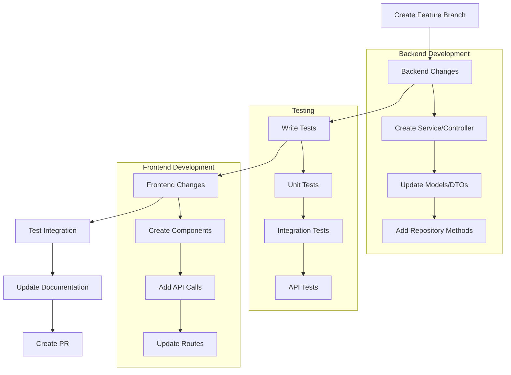

# Local Development Setup Guide

This guide will help you set up Eventr for local development with all services including the webhook test client.

## Prerequisites

### Required Software
- **Java 21 (LTS)** - [Download OpenJDK](https://adoptium.net/)
- **Maven 3.9.6+** - [Installation Guide](https://maven.apache.org/install.html)
- **Node.js 18+** - [Download](https://nodejs.org/)
- **npm 10+** (comes with Node.js)
- **Docker & Docker Compose** - [Get Docker](https://docs.docker.com/get-docker/)
- **Git** - [Download](https://git-scm.com/downloads)

### Optional Tools
- **IntelliJ IDEA** or **VS Code** for development
- **Postman** or **curl** for API testing
- **ngrok** for webhook testing with external services

## Quick Start (Recommended)

### 1. Clone and Setup

```bash
# Clone the repository
git clone https://github.com/jpwhite3/eventr.git
cd eventr

# Make scripts executable (Unix/Mac)
chmod +x start-dev.sh
chmod +x localstack-init/init-aws.sh
```

### 2. Start Infrastructure Services

```bash
# Start PostgreSQL, Redis, LocalStack, and MailHog
docker-compose up -d

# Verify services are running
docker-compose ps
```

### 3. Start All Development Services

**Option A: Using the development script (Unix/Mac)**
```bash
./start-dev.sh
```

**Option B: Using Maven profile**
```bash
./mvnw spring-boot:run -Pdev
```

**Option C: Manual startup (all terminals)**
```bash
# Terminal 1: Backend
./mvnw spring-boot:run

# Terminal 2: Frontend
cd frontend
npm install
npm start

# Terminal 3: Webhook Test Client
cd webhook-client
npm install
npm start
```

### 4. Access the Applications

Once all services are running, you can access:

| Service | URL | Description |
|---------|-----|-------------|
| **Frontend** | http://localhost:3001 | React web application |
| **Backend API** | http://localhost:8080/api | REST API endpoints |
| **API Docs** | http://localhost:8080/swagger-ui.html | Interactive API documentation |
| **Webhook Client** | http://localhost:3002 | Webhook testing interface |
| **H2 Console** | http://localhost:8080/h2-console | Database console (dev profile) |
| **MailHog** | http://localhost:8025 | Email testing interface |
| **LocalStack** | http://localhost:4566 | AWS services simulation |

## Detailed Setup Instructions

### Backend Development

#### Environment Configuration

Create `src/main/resources/application-dev.yml` for development-specific settings:

```yaml
server:
  port: 8080

spring:
  datasource:
    url: jdbc:postgresql://localhost:5432/eventr_dev
    username: eventr_user
    password: eventr_pass
    
  jpa:
    hibernate:
      ddl-auto: update
    show-sql: true
    properties:
      hibernate:
        format_sql: true
        
  mail:
    host: localhost
    port: 1025
    properties:
      mail:
        smtp:
          auth: false
          starttls:
            enable: false

aws:
  s3:
    endpoint: http://localhost:4566
    access-key: test
    secret-key: test
    region: us-east-1
    bucket: eventr-dev

logging:
  level:
    com.eventr: DEBUG
    org.springframework.web: DEBUG
    org.hibernate.SQL: DEBUG
```

#### Running Backend Tests

```bash
# Run all tests
./mvnw test

# Run tests with coverage
./mvnw test jacoco:report

# Run specific test class
./mvnw test -Dtest=WebhookServiceTest

# Run tests with specific profile
./mvnw test -Ptest
```

### Frontend Development

#### Initial Setup

```bash
cd frontend
npm install

# Install additional development tools (optional)
npm install -D @typescript-eslint/eslint-plugin
npm install -D prettier
```

#### Development Server

```bash
# Start development server with hot reloading
npm start

# Build for production
npm run build

# Run tests
npm test

# Run tests with coverage
npm test -- --coverage
```

#### Frontend Configuration

The frontend automatically proxies API requests to `http://localhost:8080` during development via the `proxy` setting in `package.json`.

### Webhook Test Client Development

#### Setup

```bash
cd webhook-client
npm install

# Set webhook secret (should match Eventr webhook secret)
export EVENTR_WEBHOOK_SECRET="dev-secret-key"

# Start the webhook client
npm start
```

#### Testing Webhooks Locally

1. **Configure a webhook in Eventr:**
   ```bash
   curl -X POST http://localhost:8080/api/webhooks \
     -H "Content-Type: application/json" \
     -d '{
       "url": "http://localhost:3002/webhook",
       "eventTypes": ["USER_REGISTERED", "USER_CHECKED_IN"],
       "active": true,
       "description": "Local development webhook"
     }'
   ```

2. **Trigger an event (e.g., user registration):**
   ```bash
   curl -X POST http://localhost:8080/api/registrations \
     -H "Content-Type: application/json" \
     -d '{
       "eventId": "your-event-id",
       "userEmail": "test@example.com",
       "userName": "Test User"
     }'
   ```

3. **View the webhook in the test client:**
   - Open http://localhost:3002
   - You should see the webhook appear in the dashboard

## Development Workflows

### Creating a New Feature



### Example: Adding a New API Endpoint

1. **Backend (Spring Boot)**
   ```kotlin
   @RestController
   @RequestMapping("/api/example")
   class ExampleController(
       private val exampleService: ExampleService
   ) {
       @PostMapping
       fun createExample(@RequestBody dto: ExampleDto): ResponseEntity<ExampleDto> {
           val result = exampleService.create(dto)
           return ResponseEntity.status(201).body(result)
       }
   }
   ```

2. **Write Tests**
   ```kotlin
   @Test
   fun `should create example successfully`() {
       val dto = ExampleDto(name = "Test")
       val result = exampleController.createExample(dto)
       
       assertEquals(HttpStatus.CREATED, result.statusCode)
       assertNotNull(result.body?.id)
   }
   ```

3. **Frontend (React)**
   ```typescript
   // api/example.ts
   export const createExample = async (data: ExampleDto): Promise<ExampleDto> => {
       const response = await fetch('/api/example', {
           method: 'POST',
           headers: { 'Content-Type': 'application/json' },
           body: JSON.stringify(data)
       });
       return response.json();
   };
   
   // components/ExampleForm.tsx
   const ExampleForm = () => {
       const handleSubmit = async (data: ExampleDto) => {
           const result = await createExample(data);
           console.log('Created:', result);
       };
       // ... component implementation
   };
   ```

## Database Management

### PostgreSQL (Development)

```bash
# Connect to the database
docker exec -it eventr_postgres psql -U eventr_user -d eventr_dev

# View tables
\dt

# Describe table structure
\d events

# Run custom queries
SELECT * FROM events WHERE type = 'TECHNOLOGY';
```

### H2 (Testing)

For integration tests, the application uses H2 in-memory database:

```yaml
# application-test.yml
spring:
  datasource:
    url: jdbc:h2:mem:testdb
    driver-class-name: org.h2.Driver
  jpa:
    hibernate:
      ddl-auto: create-drop
```

Access H2 console during development: http://localhost:8080/h2-console

## Testing Strategy

### Backend Testing

```bash
# Run all backend tests
./mvnw test

# Run tests with specific profiles
./mvnw test -Ptest

# Run integration tests only
./mvnw test -Dtest="*IntegrationTest"

# Run with coverage report
./mvnw test jacoco:report
open target/site/jacoco/index.html
```

### Frontend Testing

```bash
cd frontend

# Run all tests
npm test

# Run tests with coverage
npm test -- --coverage

# Run specific test file
npm test -- ExampleComponent.test.tsx

# Run tests in CI mode
npm test -- --ci --watchAll=false
```

### API Testing

Use the provided Postman collection or curl commands:

```bash
# Test event creation
curl -X POST http://localhost:8080/api/events \
  -H "Content-Type: application/json" \
  -d '{
    "name": "Test Event",
    "type": "IN_PERSON",
    "startDate": "2024-12-01T10:00:00Z",
    "endDate": "2024-12-01T15:00:00Z"
  }'

# Test webhook creation
curl -X POST http://localhost:8080/api/webhooks \
  -H "Content-Type: application/json" \
  -d '{
    "url": "http://localhost:3002/webhook",
    "eventTypes": ["USER_REGISTERED"]
  }'
```

## Debugging

### Backend Debugging

1. **IntelliJ IDEA:**
   - Create a "Spring Boot" run configuration
   - Set active profile to `dev`
   - Add breakpoints and debug

2. **VS Code:**
   - Install "Extension Pack for Java"
   - Use launch.json configuration:
   ```json
   {
     "type": "java",
     "name": "Debug Eventr",
     "request": "launch",
     "mainClass": "com.eventr.EventrApplication",
     "args": "--spring.profiles.active=dev"
   }
   ```

3. **Command Line:**
   ```bash
   ./mvnw spring-boot:run -Dspring-boot.run.jvmArguments="-Xdebug -Xrunjdwp:transport=dt_socket,server=y,suspend=n,address=5005"
   ```

### Frontend Debugging

1. **Browser DevTools:**
   - Open Chrome/Firefox DevTools
   - Use Sources tab for breakpoints
   - Check Network tab for API calls

2. **VS Code:**
   - Install "Debugger for Chrome" extension
   - Create launch.json:
   ```json
   {
     "type": "chrome",
     "request": "launch",
     "name": "Debug React App",
     "url": "http://localhost:3001",
     "webRoot": "${workspaceFolder}/frontend/src"
   }
   ```

### Webhook Debugging

1. **Check webhook client logs:**
   ```bash
   cd webhook-client
   npm start
   # Watch console output for webhook deliveries
   ```

2. **View webhook client dashboard:**
   - Open http://localhost:3002
   - Monitor real-time webhook deliveries
   - Check signature verification status

3. **Test webhook delivery manually:**
   ```bash
   curl -X POST http://localhost:3002/webhook \
     -H "Content-Type: application/json" \
     -H "X-Eventr-Signature: sha256=$(echo -n '{"test":"data"}' | openssl dgst -sha256 -hmac 'dev-secret-key' -binary | xxd -p)" \
     -d '{"eventType":"TEST","data":{"test":"data"}}'
   ```

## Docker Development

### Full Docker Setup

```bash
# Build all images
docker-compose -f docker-compose.dev.yml build

# Start all services in Docker
docker-compose -f docker-compose.dev.yml up

# View logs
docker-compose logs -f eventr-backend
docker-compose logs -f eventr-frontend
```

### Individual Service Development

```bash
# Build and run just the backend
docker build -t eventr-backend .
docker run -p 8080:8080 --env-file .env eventr-backend

# Build and run the frontend
cd frontend
docker build -t eventr-frontend .
docker run -p 3001:3000 eventr-frontend
```

## Environment Variables

### Backend (.env)

```bash
# Database
DATABASE_URL=jdbc:postgresql://localhost:5432/eventr_dev
DATABASE_USERNAME=eventr_user
DATABASE_PASSWORD=eventr_pass

# AWS
AWS_S3_ENDPOINT=http://localhost:4566
AWS_ACCESS_KEY_ID=test
AWS_SECRET_ACCESS_KEY=test
AWS_S3_BUCKET=eventr-dev

# Email
SMTP_HOST=localhost
SMTP_PORT=1025
SMTP_USERNAME=
SMTP_PASSWORD=

# Webhook
WEBHOOK_SECRET_KEY=dev-secret-key
```

### Webhook Client (.env)

```bash
PORT=3002
EVENTR_WEBHOOK_SECRET=dev-secret-key
```

## Performance Optimization

### Backend

1. **Enable caching:**
   ```yaml
   spring:
     cache:
       type: redis
     redis:
       host: localhost
       port: 6379
   ```

2. **Database optimization:**
   ```yaml
   spring:
     datasource:
       hikari:
         maximum-pool-size: 20
         minimum-idle: 5
   ```

3. **JVM tuning:**
   ```bash
   export JAVA_OPTS="-Xms512m -Xmx2g -XX:+UseG1GC"
   ./mvnw spring-boot:run
   ```

### Frontend

1. **Build optimization:**
   ```bash
   # Analyze bundle size
   npm run build
   npm install -g source-map-explorer
   source-map-explorer build/static/js/*.js
   ```

2. **Development optimization:**
   ```bash
   # Fast refresh and better error overlay
   npm start
   ```

## Common Issues and Solutions

### Backend Issues

1. **Port 8080 already in use:**
   ```bash
   # Find and kill process
   lsof -ti:8080 | xargs kill -9
   
   # Or use different port
   ./mvnw spring-boot:run -Dserver.port=8081
   ```

2. **Database connection issues:**
   ```bash
   # Restart PostgreSQL container
   docker-compose restart postgres
   
   # Check container logs
   docker-compose logs postgres
   ```

3. **Out of memory errors:**
   ```bash
   export MAVEN_OPTS="-Xmx2g"
   ./mvnw spring-boot:run
   ```

### Frontend Issues

1. **Module not found errors:**
   ```bash
   # Clear node_modules and reinstall
   cd frontend
   rm -rf node_modules package-lock.json
   npm install
   ```

2. **Proxy errors:**
   ```bash
   # Check backend is running on port 8080
   curl http://localhost:8080/api/health
   ```

### Webhook Client Issues

1. **Webhooks not received:**
   - Check webhook URL configuration in Eventr
   - Verify webhook client is running on port 3002
   - Check network connectivity

2. **Signature verification fails:**
   - Ensure `EVENTR_WEBHOOK_SECRET` matches
   - Check webhook secret in Eventr configuration

## Next Steps

Once your development environment is set up:

1. **Explore the codebase:**
   - Review [Architecture Documentation](architecture.md)
   - Study [API Documentation](api.md)
   - Read [Webhook Integration Guide](webhooks.md)

2. **Run the test suite:**
   ```bash
   ./mvnw test
   cd frontend && npm test
   ```

3. **Try creating a webhook integration:**
   - Configure a webhook pointing to your test client
   - Register for an event and watch the webhook fire

4. **Start developing:**
   - Create a feature branch
   - Make your changes
   - Write tests
   - Submit a pull request

## Support

For development support:
- Check [GitHub Issues](https://github.com/jpwhite3/eventr/issues)
- Review existing [Pull Requests](https://github.com/jpwhite3/eventr/pulls)
- Read the full documentation in the `docs/` directory