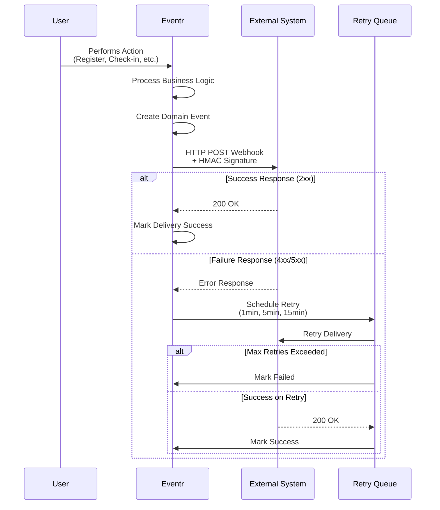
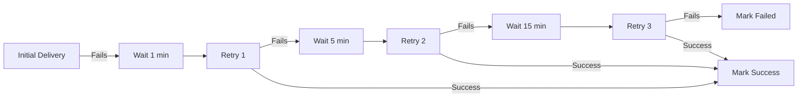

# Webhook Integration Guide

## Overview

Eventr's webhook system enables real-time integration with external services by sending HTTP POST notifications when specific events occur in the system. This allows you to build automated workflows, sync data with external systems, or trigger custom business logic.

## How Webhooks Work



## Supported Event Types

### User Events
- `USER_REGISTERED`: When a user registers for an event
- `USER_CANCELLED`: When a user cancels their registration
- `USER_CHECKED_IN`: When a user checks into an event or session
- `USER_CHECKED_OUT`: When a user checks out of an event or session

### Event Management
- `EVENT_CREATED`: When a new event is created
- `EVENT_UPDATED`: When event details are modified
- `EVENT_CANCELLED`: When an event is cancelled

### Session Management
- `SESSION_CREATED`: When a new session is added to an event
- `SESSION_UPDATED`: When session details are modified
- `SESSION_CANCELLED`: When a session is cancelled

## Webhook Configuration

### Creating a Webhook

```http
POST /api/webhooks
Content-Type: application/json

{
  "url": "https://your-system.com/webhooks/eventr",
  "eventTypes": ["USER_REGISTERED", "USER_CHECKED_IN"],
  "active": true,
  "description": "Integration with CRM system"
}
```

**Response:**
```json
{
  "id": "webhook-uuid",
  "url": "https://your-system.com/webhooks/eventr",
  "eventTypes": ["USER_REGISTERED", "USER_CHECKED_IN"],
  "active": true,
  "secret": "whsec_generated-secret-key",
  "description": "Integration with CRM system",
  "status": "ACTIVE",
  "createdAt": "2024-08-24T10:00:00Z",
  "statistics": {
    "totalDeliveries": 0,
    "successfulDeliveries": 0,
    "failedDeliveries": 0,
    "successRate": 0.0
  }
}
```

### Managing Webhooks

**List all webhooks:**
```http
GET /api/webhooks
```

**Get webhook details:**
```http
GET /api/webhooks/{webhookId}
```

**Update webhook:**
```http
PUT /api/webhooks/{webhookId}
Content-Type: application/json

{
  "url": "https://new-endpoint.com/webhooks",
  "eventTypes": ["USER_REGISTERED", "USER_CHECKED_IN", "EVENT_CREATED"],
  "active": true
}
```

**Delete webhook:**
```http
DELETE /api/webhooks/{webhookId}
```

**Regenerate secret:**
```http
PUT /api/webhooks/{webhookId}/secret
```

**Test webhook:**
```http
POST /api/webhooks/{webhookId}/test
```

## Webhook Payload Format

All webhook payloads follow this structure:

```json
{
  "id": "delivery-uuid",
  "eventId": "domain-event-uuid",
  "eventType": "USER_REGISTERED",
  "timestamp": "2024-08-24T10:15:30Z",
  "data": {
    // Event-specific payload
  },
  "metadata": {
    "webhookId": "webhook-uuid",
    "attempt": 1,
    "maxAttempts": 3
  }
}
```

### Event-Specific Payloads

#### USER_REGISTERED
```json
{
  "id": "delivery-uuid",
  "eventId": "registration-event-uuid",
  "eventType": "USER_REGISTERED",
  "timestamp": "2024-08-24T10:15:30Z",
  "data": {
    "registrationId": "reg-uuid",
    "eventId": "event-uuid",
    "eventName": "Tech Conference 2024",
    "userEmail": "user@example.com",
    "userName": "John Doe",
    "registrationStatus": "REGISTERED",
    "registeredAt": "2024-08-24T10:15:30Z",
    "additionalInfo": {
      "company": "Tech Corp",
      "dietary_restrictions": "Vegetarian"
    }
  }
}
```

#### USER_CHECKED_IN
```json
{
  "id": "delivery-uuid",
  "eventId": "checkin-event-uuid",
  "eventType": "USER_CHECKED_IN",
  "timestamp": "2024-08-24T14:30:00Z",
  "data": {
    "checkInId": "checkin-uuid",
    "registrationId": "reg-uuid",
    "eventId": "event-uuid",
    "sessionId": "session-uuid",
    "userEmail": "user@example.com",
    "userName": "John Doe",
    "checkInMethod": "QR_CODE",
    "location": "Main Entrance",
    "checkedInAt": "2024-08-24T14:30:00Z"
  }
}
```

#### EVENT_CREATED
```json
{
  "id": "delivery-uuid",
  "eventId": "event-creation-uuid",
  "eventType": "EVENT_CREATED",
  "timestamp": "2024-08-24T09:00:00Z",
  "data": {
    "eventId": "event-uuid",
    "eventName": "New Conference 2024",
    "eventType": "HYBRID",
    "category": "TECHNOLOGY",
    "startDate": "2024-12-01T09:00:00Z",
    "endDate": "2024-12-01T17:00:00Z",
    "maxAttendees": 500,
    "location": "Convention Center",
    "createdBy": "admin@company.com"
  }
}
```

## Security

### HMAC Signature Verification

Every webhook request includes an HMAC-SHA256 signature in the `X-Eventr-Signature` header for security verification.

**Header Format:**
```
X-Eventr-Signature: sha256=computed-signature-hash
```

**Verification Process:**

1. **Extract the signature** from the `X-Eventr-Signature` header
2. **Compute HMAC-SHA256** using your webhook secret and the raw request body
3. **Compare signatures** using a constant-time comparison

#### Example Implementation (Node.js)

```javascript
const crypto = require('crypto');

function verifyWebhookSignature(payload, signature, secret) {
    // Remove 'sha256=' prefix if present
    const receivedSignature = signature.startsWith('sha256=') 
        ? signature.slice(7) 
        : signature;
    
    // Compute expected signature
    const expectedSignature = crypto
        .createHmac('sha256', secret)
        .update(payload, 'utf8')
        .digest('hex');
    
    // Use constant-time comparison to prevent timing attacks
    return crypto.timingSafeEqual(
        Buffer.from(receivedSignature, 'hex'),
        Buffer.from(expectedSignature, 'hex')
    );
}

// Express.js middleware example
app.use('/webhooks/eventr', express.raw({ type: 'application/json' }));

app.post('/webhooks/eventr', (req, res) => {
    const signature = req.headers['x-eventr-signature'];
    const payload = req.body;
    const secret = process.env.EVENTR_WEBHOOK_SECRET;
    
    if (!verifyWebhookSignature(payload, signature, secret)) {
        return res.status(401).json({ error: 'Invalid signature' });
    }
    
    // Process the webhook
    const event = JSON.parse(payload);
    console.log('Received webhook:', event.eventType, event.data);
    
    res.status(200).json({ success: true });
});
```

#### Example Implementation (Python)

```python
import hashlib
import hmac
import json
from flask import Flask, request

app = Flask(__name__)

def verify_webhook_signature(payload, signature, secret):
    """Verify webhook signature using HMAC-SHA256"""
    # Remove 'sha256=' prefix if present
    received_signature = signature.replace('sha256=', '') if signature.startswith('sha256=') else signature
    
    # Compute expected signature
    expected_signature = hmac.new(
        secret.encode('utf-8'),
        payload,
        hashlib.sha256
    ).hexdigest()
    
    # Use constant-time comparison
    return hmac.compare_digest(received_signature, expected_signature)

@app.route('/webhooks/eventr', methods=['POST'])
def handle_webhook():
    signature = request.headers.get('X-Eventr-Signature')
    payload = request.get_data()
    secret = os.environ.get('EVENTR_WEBHOOK_SECRET')
    
    if not verify_webhook_signature(payload, signature, secret):
        return {'error': 'Invalid signature'}, 401
    
    # Process the webhook
    event = json.loads(payload)
    print(f"Received webhook: {event['eventType']} - {event['data']}")
    
    return {'success': True}, 200
```

## Delivery and Retry Logic

### Delivery Requirements

For a webhook delivery to be considered successful:
- HTTP response status must be in the 200-299 range
- Response must be received within 30 seconds
- Response body can be empty or contain any content

### Retry Strategy

Failed deliveries are automatically retried with exponential backoff:



**Retry Schedule:**
1. **Initial delivery**: Immediate
2. **Retry 1**: After 1 minute
3. **Retry 2**: After 5 minutes  
4. **Retry 3**: After 15 minutes
5. **Final failure**: Marked as failed permanently

### Handling Failures

**Best Practices for your webhook endpoint:**

1. **Return appropriate HTTP status codes:**
   - `200-299`: Success, delivery will be marked complete
   - `400-499`: Client error, delivery will be marked failed (no retry)
   - `500-599`: Server error, delivery will be retried

2. **Implement idempotency:** Use the `eventId` to prevent duplicate processing

3. **Respond quickly:** Aim for sub-second response times

4. **Log webhook events:** For debugging and audit purposes

## Testing Webhooks

### Using the Test Endpoint

You can test your webhook endpoint configuration:

```http
POST /api/webhooks/{webhookId}/test
```

This sends a test payload to verify connectivity and signature verification.

### Local Development with ngrok

For local development, use ngrok to expose your local server:

```bash
# Install ngrok (if not already installed)
npm install -g ngrok

# Expose your local server
ngrok http 3000

# Use the generated HTTPS URL for your webhook
# e.g., https://abc123.ngrok.io/webhooks/eventr
```

### Webhook Test Client

Eventr includes a simple webhook test client for local development:

```bash
cd webhook-client
npm install
npm start
```

The test client will:
- Start a server on port 3002
- Accept webhook deliveries at `/webhook`
- Log all received webhooks to console
- Verify HMAC signatures
- Provide a simple web interface to view recent webhooks

**Test Client Interface:** http://localhost:3002

## Integration Examples

### CRM Integration (Salesforce)

```javascript
// Sync user registrations to Salesforce
app.post('/webhooks/eventr', async (req, res) => {
    const event = JSON.parse(req.body);
    
    if (event.eventType === 'USER_REGISTERED') {
        const { userEmail, userName, eventName } = event.data;
        
        // Create or update lead in Salesforce
        await salesforce.sobject('Lead').upsert({
            Email: userEmail,
            LastName: userName,
            Company: event.data.additionalInfo?.company || 'Unknown',
            LeadSource: 'Event Registration',
            Description: `Registered for ${eventName}`
        }, 'Email');
    }
    
    res.status(200).json({ success: true });
});
```

### Email Marketing Integration

```python
@app.route('/webhooks/eventr', methods=['POST'])
def handle_eventr_webhook():
    event = json.loads(request.get_data())
    
    if event['eventType'] == 'USER_REGISTERED':
        # Add to email campaign
        mailchimp_client.lists.add_member(
            list_id=EMAIL_LIST_ID,
            member_info={
                'email_address': event['data']['userEmail'],
                'status': 'subscribed',
                'merge_fields': {
                    'FNAME': event['data']['userName'].split(' ')[0],
                    'EVENT': event['data']['eventName']
                }
            }
        )
    
    elif event['eventType'] == 'USER_CHECKED_IN':
        # Send follow-up sequence
        trigger_email_sequence(
            email=event['data']['userEmail'],
            sequence='post-event-followup'
        )
    
    return {'success': True}
```

### Slack Notifications

```javascript
app.post('/webhooks/eventr', async (req, res) => {
    const event = JSON.parse(req.body);
    
    if (event.eventType === 'EVENT_CREATED') {
        await slack.chat.postMessage({
            channel: '#events',
            text: `🎉 New event created: *${event.data.eventName}*`,
            attachments: [{
                color: 'good',
                fields: [
                    { title: 'Date', value: event.data.startDate, short: true },
                    { title: 'Type', value: event.data.eventType, short: true },
                    { title: 'Max Attendees', value: event.data.maxAttendees, short: true }
                ]
            }]
        });
    }
    
    res.status(200).json({ success: true });
});
```

## Monitoring and Debugging

### Webhook Statistics

Monitor webhook performance through the API:

```http
GET /api/webhooks/{webhookId}
```

**Response includes statistics:**
```json
{
  "statistics": {
    "totalDeliveries": 1250,
    "successfulDeliveries": 1198,
    "failedDeliveries": 52,
    "successRate": 95.84,
    "averageResponseTime": 145.3,
    "lastSuccessAt": "2024-08-24T15:30:00Z",
    "lastFailureAt": "2024-08-24T14:22:00Z"
  }
}
```

### Common Issues

**1. Signature Verification Failures**
- Ensure you're using the correct secret
- Use raw request body for signature calculation
- Implement constant-time comparison

**2. Timeout Issues**
- Optimize your webhook handler for speed
- Consider async processing for heavy operations
- Return 200 OK quickly, process in background

**3. High Failure Rates**
- Check server logs for error patterns
- Verify endpoint URL is accessible from Eventr servers
- Implement proper error handling and logging

### Debugging Tips

1. **Enable request logging** in your webhook handler
2. **Use webhook test functionality** to verify setup
3. **Monitor webhook statistics** for performance trends
4. **Implement health checks** for your webhook endpoints
5. **Use webhook test client** during local development

## Security Best Practices

1. **Always verify signatures** using HMAC-SHA256
2. **Use HTTPS endpoints** for production webhooks
3. **Implement rate limiting** on your webhook endpoints
4. **Validate payload structure** before processing
5. **Store webhook secrets securely** (environment variables, secret management)
6. **Log security events** (failed signature verification, suspicious activity)
7. **Implement IP allowlisting** if required by your security policy

## Webhook Limits

- **Maximum URL length**: 2048 characters
- **Maximum event types per webhook**: 10
- **Maximum retry attempts**: 3
- **Request timeout**: 30 seconds
- **Maximum payload size**: 1MB
- **Maximum webhooks per account**: 100

## Support

For webhook integration support:
- Review the [API Documentation](api.md)
- Check [GitHub Issues](https://github.com/jpwhite3/eventr/issues)
- Use the webhook test client for local development
- Monitor webhook statistics for debugging